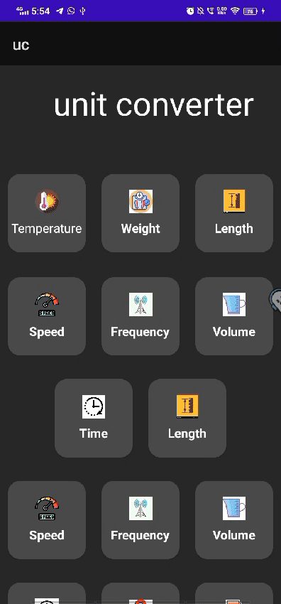

# Unit Converter App
This mobile Unit Converter app is designed for Android, offering a sleek and intuitive interface to handle various unit conversions with ease. Built using XML for the user interface and Java for the backend logic, this app provides accurate and quick conversions across multiple unit types. With this app, users can convert various units, such as length, weight, temperature, and more, with ease. Each unit type is categorized for easy navigation, and conversions are designed to be precise and efficient.

# Features
• Comprehensive Unit Types: Convert units across categories like length, weight, temperature, volume, and more.
• User-Friendly Design: Simple and clean XML-based UI for smooth navigation.
• Fast and Accurate: Instant conversions with precise calculation logic in Java.
• Lightweight and Efficient: Optimized to perform well on mobile devices.

# Tech Stack
• Frontend: XML for UI layouts
• Backend: Java for conversion logic and functionality

# Getting Started
Clone the Repository:

git clone https://github.com/your-username/unit-converter-app.git

Open in Android Studio and run the app on an emulator or a physical Android device.

# DEMO

# License
This project is open source and available under the MIT License.
